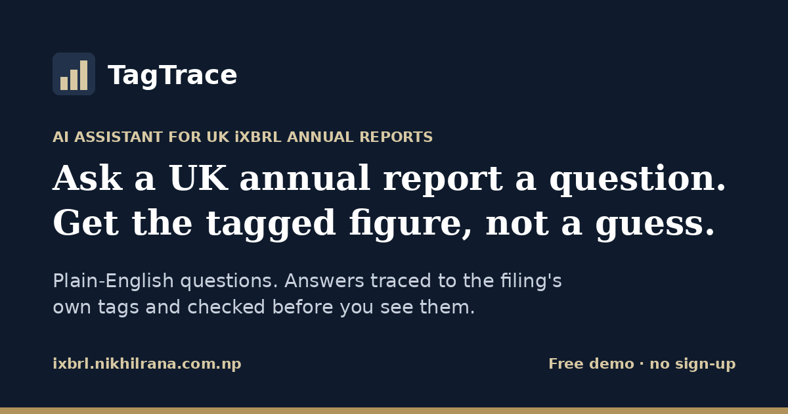

# TagTrace

**Ask a UK annual report a question. Get the tagged figure, not a guess.**

TagTrace is a free web app that answers plain-English questions about UK company accounts. It doesn't let an AI read a long report and guess. It looks up the exact figures the company tagged in its filing, makes the AI say which ones it used, and checks them before you see the answer.

**Try it:** https://ixbrl.nikhilrana.com.np



> The free server may take up to a minute to wake up if nobody has used it recently.

---

## Who it's for

You don't need any accounting knowledge. People use it to:

- **Check a business they deal with**, such as a supplier, customer, landlord or a company they have an interview with
- **Learn to read company accounts**, since every answer shows which line it came from
- **Research and journalism**: pull a figure quickly with the exact source attached
- **Accountants and analysts**: a fast first look-up (always confirm against the filing)
- **People working on AI**: see one practical way to stop a model making up numbers

## How to use it (2 minutes)

1. **Get a filing.** Go to [Find and update company information](https://find-and-update.company-information.service.gov.uk/) on GOV.UK. It's free and needs no account.
   - Search the company's name or number
   - Open the **Filing history** tab
   - Next to a set of accounts, click **Download iXBRL**. You'll get an `.xhtml` file.
   - If there's only a *View PDF* link, those accounts weren't filed digitally and won't work.
   - **Listed company?** Big names often only have a PDF on Companies House. Open the FCA's [National Storage Mechanism](https://data.fca.org.uk/#/nsm/nationalstoragemechanism), search the company, set **ESEF AFR type** to **Tagged**, and download the annual report.
2. **Upload it** on the site (drag and drop, up to 25 MB).
3. **Ask a question** in everyday words, for example:
   - *What was turnover for the year?*
   - *How much cash did the company have at the year end?*
   - *What were net assets at the balance sheet date?*
   - *How did profit change compared with last year?*
   - *Summarise the going concern disclosure.*

> **Tip:** many small companies file only a balance sheet, without a profit and loss account. If TagTrace says *"Not in tagged data"* for turnover or profit, the figure usually isn't in that filing. Try cash or net assets instead.

## What you get the moment a filing loads

No AI involved, so these don't use any questions:

- **Headline figures** with the change on the prior year
- **Key ratios** calculated from the tagged figures: revenue growth, gross, operating and net margin, return on equity, cash conversion, current ratio and net cash or debt. Tap a ratio to see the exact figures and tags it came from.
- **Fact explorer**: search every tagged number in the filing, filter by period or breakdown, and send any figure to the AI as a question
- **Quick asks**: one-tap questions grouped as Performance, Balance sheet, Shareholders and Disclosures, offered only when the filing tags the data to answer them

## Reading an answer

Every answer is a card that shows the value, the tag it came from, the period (e.g. *year ended 31 December 2025*), any breakdown, and one of these badges:

| Badge | Meaning |
|---|---|
| **Matched to tagged fact** | Read straight from one tagged figure in the filing |
| **Computed from tagged facts** | The server did the arithmetic (e.g. a year-on-year change), not the AI |
| **Quote found in filing** | A narrative answer whose quote appears word for word in the filing |
| **Not verified** | The AI's answer couldn't be confirmed. Treat it with care. |
| **Not in tagged data** | Nothing in the filing answers it, so no number is made up |

Use the thumbs up or down under an answer to say whether it was right. Votes are logged, with the question and answer, to measure real-world accuracy.

**What it can't guarantee:** the server can confirm that a number is really in the filing, but not that it's the *right* one for your question. The AI could still pick last year's figure or a breakdown instead of the total. Always check the period and breakdown on the card.

## A few terms, in plain English

| Term | Meaning |
|---|---|
| **iXBRL filing** | An annual report saved as a web page with hidden labels ("tags") on every number, so a computer can read each figure exactly |
| **Revenue / turnover** | Money earned from sales, before costs |
| **Profit before tax** | Profit after all costs and interest, before corporation tax |
| **Net assets** | What the company owns minus what it owes, on the balance sheet date |
| **"Year ended" vs "as at"** | Profit covers a period; balance sheet figures are a snapshot on one day |
| **Dimension** | A breakdown of a figure, such as one business segment or one class of asset |
| **FRS 102 / IFRS** | The two sets of UK accounting rules: most private companies use FRS 102, listed groups use IFRS |

The site has a fuller glossary and FAQ.

## How it works

```
iXBRL filing ──► parse every tagged fact ──► store (concept, value, period, dimensions)
                                                   │
question ──► find the concepts it's about ──► send only those facts to the AI
                                                   │
             AI must reply with the IDs of the facts it used
                                                   │
             server reads the value itself, does any arithmetic itself,
             checks quotes appear verbatim ──► answer card + badge
```

1. **Parse.** The iXBRL document is read directly with `lxml`. Scale, sign, nil values, continuation chains and `ix:exclude` are handled, and no taxonomy download is needed.
2. **Store.** Every fact is kept with its concept, unit, period and dimensions. When a concept is tagged several times, all versions are kept.
3. **Retrieve.** Tag-aware retrieval picks the facts that match the question, so the model reads structured evidence instead of a cut-down slice of a very long report.
4. **Verify.** The model must cite evidence IDs. The server hydrates the cited facts, computes any arithmetic, and checks narrative quotes against the tagged text.

## The research behind it

TagTrace comes from my MSc Artificial Intelligence dissertation at the University of West London (2026), *Detecting and Mitigating Hallucinations in Large Language Models for Financial Document Analysis: A Focus on UK iXBRL Reporting*, supervised by Dr Ali Gheitasy.

On a 102-question benchmark across 12 UK filings (8 FTSE 350 under IFRS, 4 private companies under FRS 102):

| Approach | Correct | Wrong | No answer |
|---|---|---|---|
| Claude · reads report text | 45.1% | 3 | 53 |
| Claude · tagged figures | **92.2%** | 4 | 4 |
| GPT-5.6 Terra · reads report text | 43.1% | 3 | 55 |
| GPT-5.6 Terra · tagged figures | 84.3% | 4 | 12 |

- Giving the model the tagged figures fixed coverage: Claude improved from 45.1% to 92.2%, +47.1 percentage points (95% CI 37.3–56.9). Most of the gain came from fewer unanswered questions (52% → 3.9%) rather than fewer mistakes (6.1% → 4.1% of attempted answers).
- With the same evidence, both models made 4 mistakes (4.1% vs 4.4% of attempted answers). GPT-5.6 Terra declined more questions (12 vs 4), so it scored 84.3% against Claude's 92.2% (difference 7.8 pp, 95% CI 2.9–12.7).
- Self-consistency sampling caught none of the wrong answers, because the errors were systematic. That's why TagTrace checks answers against the filing instead.

*Limitations:* a small corpus and a small number of consistency samples, and results may not carry over to every filing. The live site uses a structured-output variant of the method with server-side checks, so it isn't exactly the benchmarked setup.

## Privacy and limits

- Uploaded files are deleted as soon as they're parsed. Extracted facts are deleted when you clear the filing or after 30 minutes of inactivity.
- Your question and the retrieved facts are sent to OpenAI (public model) or Anthropic (Claude) to write the answer. Only upload public filings.
- The public model is free for 25 questions per visit. Claude needs an access code, which you can request through the contact links on the site.
- This is a research demonstration, **not financial advice**.

## Running it yourself

Requires **Python 3.12** (some pinned dependencies have no wheels for 3.13 yet).

```bash
git clone https://github.com/NikhilRana2076/ixbrl-qa-demo.git
cd ixbrl-qa-demo
python -m venv .venv
# Windows: .venv\Scripts\activate    macOS/Linux: source .venv/bin/activate
pip install -r requirements-web.txt
cp .env.example .env        # then add your own OPENAI_API_KEY / ANTHROPIC_API_KEY
python -m flask --app wsgi run --port 5000
```

Open http://127.0.0.1:5000. To preview the interface without any API keys (canned answers, fictional filing):

```bash
python tests/preview_server.py     # http://127.0.0.1:5055
python -m pytest -q tests          # 20 tests, no API calls
```

Deployment notes (Render, access codes, spend caps) are in [DEPLOY.md](DEPLOY.md).

### Project layout

```
src/        parser, fact store, retrieval and model clients from the dissertation
webapp/     Flask app: routes, answer verification, security, quotas, page content
tests/      unit tests with stubbed models, plus a smoke test against the real parser
```

## Built by

**Nikhil Rana**: [Portfolio](https://nikhilrana.com.np)

iXBRL and XBRL are trademarks of XBRL International Inc. TagTrace is an independent project, not affiliated with XBRL International, Companies House, the FCA, OpenAI or Anthropic. Filings on the Companies House register are Crown copyright, used under the Open Government Licence v3.0.

© 2026 Nikhil Rana. All rights reserved.
